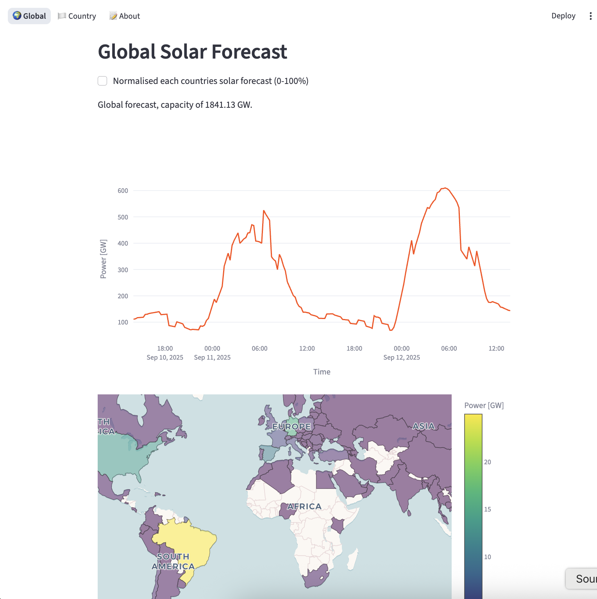

# OCF Template

**Starting point for OCF projects**
 
[](https://github.com/openclimatefix/global-solar-forecast/actions/workflows/ci.yml)
[](https://github.com/openclimatefix/global-solar-forecast/tags)
[](https://openclimatefix.github.io/global-solar-forecast/)
[](https://github.com/openclimatefix/global-solar-forecast/graphs/contributors)

[](https://github.com/openclimatefix#how-easy-is-it-to-get-involved)

⚠️ This project is a working-in-progress

This aim of this project is about making a global solar forecast. We want to make a 0-48 hours forecast for every country in the world. 

We need to get the solar capacity for every countries, and then create a solar forecast.

We get the **solar capacities** from mainly from Ember and add a few in manually. 

The **solar forecast** is very simple, 
- as it assume one solar panel in the middle of the country, 
- then we scaled it to the capacity of the country
- We use `open.quartz.solar` which is for domestic solar, and uses free weather forecasts. 




## Installation


## Example usage

To start app run
```uv run streamlit run src/v1/main.py```


## Documentation


## FAQ


## Development

Thigns to do
- Tidy up data, 

### Running the test suite

TODO
 

## Contributing and community

[](https://github.com/openclimatefix/global-solar-forecast/issues?q=is%3Aissue+is%3Aopen+sort%3Aupdated-desc)

- PR's are welcome! See the [Organisation Profile](https://github.com/openclimatefix) for details on contributing
- Find out about our other projects in the [here](https://github.com/openclimatefix/.github/tree/main/profile)
- Check out the [OCF blog](https://openclimatefix.org/blog) for updates
- Follow OCF on [LinkedIn](https://uk.linkedin.com/company/open-climate-fix)


## Contributors

<!-- ALL-CONTRIBUTORS-LIST:START - Do not remove or modify this section -->
<!-- prettier-ignore-start -->
<!-- markdownlint-disable -->

<!-- markdownlint-restore -->
<!-- prettier-ignore-end -->

<!-- ALL-CONTRIBUTORS-LIST:END -->

---

*Part of the [Open Climate Fix](https://github.com/orgs/openclimatefix/people) community.*

[](https://openclimatefix.org)
